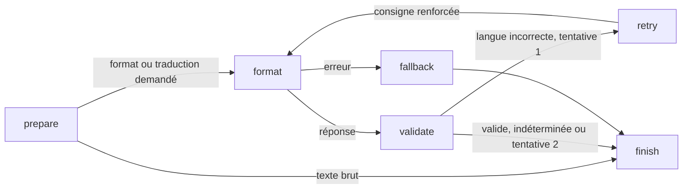

# Comprendre le pipeline LangGraph

Dans **Paramètres → Reformulation → Pipeline**, choisir **LangGraph + LangChain**, puis
Sauvegarder. Le défaut reste **Historique (comparaison)**. Redémarrer l'application après une
mise à jour du code. Le même format, la même langue et les mêmes paramètres Ollama s'appliquent
aux deux choix ; changer de pipeline ne modifie pas les consignes personnalisées.

Après une dictée, ouvrir **menu de la barre système → Exécutions locales**. Sélectionner une
exécution puis une ligne pour voir le texte avant/après et, pour `format`, la consigne réellement
envoyée au modèle. Les dix dernières exécutions permettent de comparer les deux pipelines.
La fenêtre ne s'ouvre jamais automatiquement et ne prend donc pas le focus pendant un collage.
Les durées sont mesurées dans les étapes ; leur somme exclut la compilation du graphe, Whisper,
le sélecteur et le collage. Les étapes très courtes peuvent afficher 0,0 ms.

## Nœuds, arêtes, état et appels

Whisper, le filtre d'hallucinations et les corrections de vocabulaire restent dans le traitement
commun en amont, exécuté une fois. Le graphe reçoit leur résultat : dans ce document et dans les
messages de repli, « texte brut » signifie ce texte corrigé, avant reformulation.



- **LangGraph** exécute un `StateGraph` compilé dans le thread de traitement existant. Les nœuds
  renvoient des mises à jour de l'état ; les arêtes conditionnelles lisent `route`.
- **État** : `source` conserve l'entrée, `candidate` la dernière réponse, `prompt` la consigne,
  `attempt` compte les appels, `route` choisit la suite, `warning` et `error` portent les problèmes.
- **LangChain** : `format` utilise le client officiel `langchain_ollama.ChatOllama` pour le backend
  Ollama. Il envoie les messages système et utilisateur. Le nettoyage des balises de réflexion,
  préambules et clôtures de code reprend `backends.clean_output`.
- **Validation** : l'heuristique existante n'est pas un modèle et ne fait aucun appel réseau.
  Une langue indéterminée est acceptée comme auparavant. Une mauvaise langue autorise exactement
  une seconde tentative, avec la source initiale et la directive de correction existante.
- **Repli** : un échec initial rend la source. Si la seconde tentative échoue, la première réponse
  est conservée avec avertissement. Si la seconde réponse reste dans la mauvaise langue, elle est
  rendue avec avertissement. Il n'y a aucun basculement automatique vers Claude ou un service cloud.
- **Livraison** : le contrôleur reçoit un résultat unique. Lui seul copie et éventuellement colle,
  selon les options Général et sélecteur. Le graphe ne touche jamais au presse-papier. Le texte
  brut n'est plus copié provisoirement avant l'appel : il est livré une seule fois en cas d'échec.

Le chemin historique conserve son client HTTP et sa fonction de validation/retry. Son inspecteur
montre les appels du backend et le résultat ; les nœuds de validation et de retry distincts sont
propres au choix LangGraph. Le backend Claude Code existant reste disponible s'il est explicitement
sélectionné, y compris par un format personnalisé ; il garde son fonctionnement réseau.

## Données et confidentialité

Cette intégration est une bibliothèque Python dans l'application, pas un plugin qui exporte le
projet. Pour Ollama dans le nouveau chemin :

1. `/api/show` reçoit uniquement le nom du modèle, afin de lire ses capacités et de refuser
   `remote_model` ou `remote_host` (alias de modèle distant). Si cette vérification échoue, aucune
   dictée n'est envoyée.
2. `/api/chat` reçoit le nom du modèle, le texte nettoyé, la consigne du format/langue et les options
   d'inférence : température, top_p, contexte, keep_alive et désactivation de la réflexion si
   supportée. Une seconde tentative répète le texte source avec la consigne renforcée.
3. Aucun fichier source du projet, audio, historique des autres dictées ni configuration complète
   n'est joint. Un terme ou contenu personnel dicté fait naturellement partie du texte transmis.
4. L'hôte doit être loopback (`127.0.0.1`, `localhost` ou `::1`), sans identifiants dans l'URL.
   Les noms contenant `cloud` et les alias distants sont refusés. Les proxies d'environnement et
   les redirections HTTP sont désactivés. Le préchargement historique est désactivé dans ce mode,
   afin de ne pas contourner ce chemin ; le premier appel peut donc être plus lent.
5. Le graphe et ChatOllama sont exécutés sous `langsmith.tracing_context(enabled=False)`, même si
   `LANGSMITH_TRACING`, `LANGCHAIN_TRACING_V2` et une clé API sont présents. Aucun callback de
   tracing n'est ajouté. LangSmith est installé comme dépendance des bibliothèques, mais aucun
   service LangSmith n'est utilisé. Aucun compte n'est nécessaire.
6. La vue garde dix rapports en mémoire seulement, comprenant textes, consignes et durées.
   **Effacer** supprime cet historique ; quitter l'application le perd. Fermer la fenêtre le
   conserve. Aucun checkpoint, fichier de trace ou serveur de visualisation n'est créé.

Ces restrictions concernent le nouveau chemin Ollama. Le chemin historique conserve son hôte
configurable (potentiellement distant), et Claude Code reste un choix réseau. Les journaux console
préexistants de l'application, qui peuvent contenir le début des transcriptions, ne sont pas modifiés.
Le serveur Ollama local lui-même reste un composant de confiance ; le client ne peut contrôler un
proxy ou serveur local volontairement modifié.

## Installation et vérification

L'installateur inclut `langchain-ollama==1.1.0` et `langgraph==1.2.11`. Pour un virtualenv existant :

```bash
.venv/bin/python -m pip install 'langchain-ollama==1.1.0' 'langgraph==1.2.11'
QT_QPA_PLATFORM=offscreen .venv/bin/python -m pytest -q
.venv/bin/python -m pip check
```

Les tests exécutent le vrai graphe avec modèles déterministes, ainsi que le vrai ChatOllama avec
transport HTTP simulé. Ils vérifient les arêtes, la borne de retry, les replis, les paramètres envoyés,
les refus d'hôtes et modèles distants, l'absence de client LangSmith malgré l'environnement, le
réglage persistant, la vue hors écran et la livraison unique avec les options de collage. Ils ne
nécessitent ni micro, ni GPU, ni serveur réseau. Le pipeline historique reste utilisable sans les
nouveaux paquets ; une sélection LangGraph sans dépendances rend le texte brut avec avertissement.

Références officielles utilisées :

- [ChatOllama](https://docs.langchain.com/oss/python/integrations/chat/ollama)
- [API StateGraph](https://docs.langchain.com/oss/python/langgraph/graph-api)
- [Désactivation sélective du tracing](https://docs.langchain.com/langsmith/trace-with-langchain)
- [Champs remote_model et remote_host d'Ollama](https://github.com/ollama/ollama/blob/main/api/types.go)
